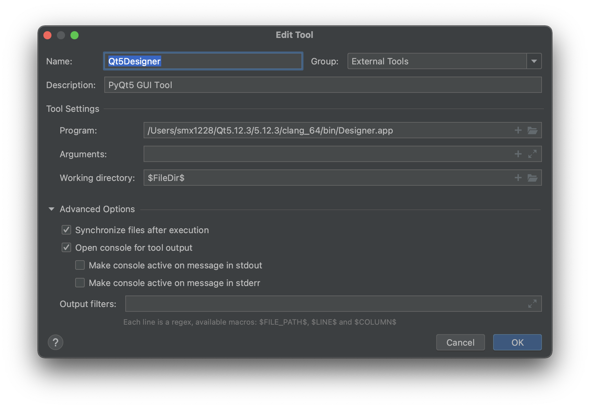
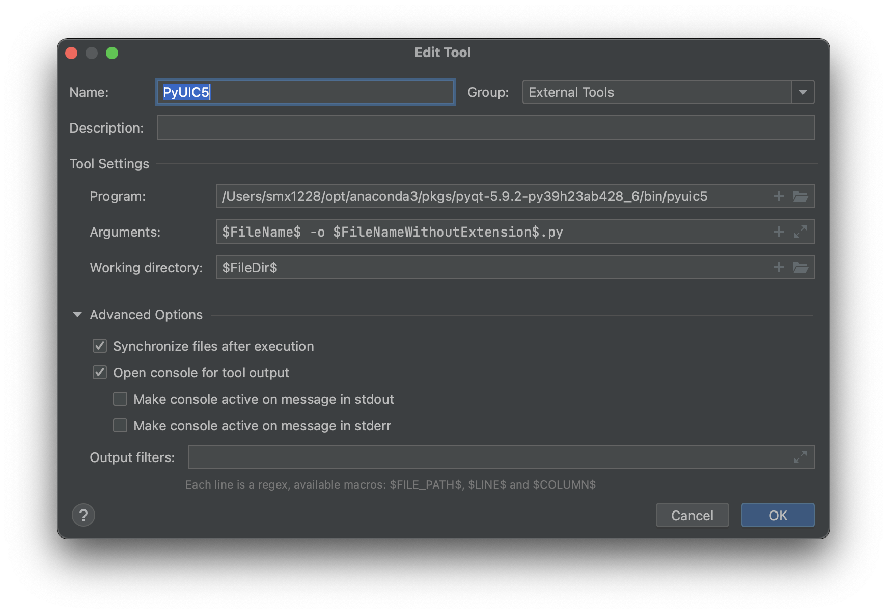
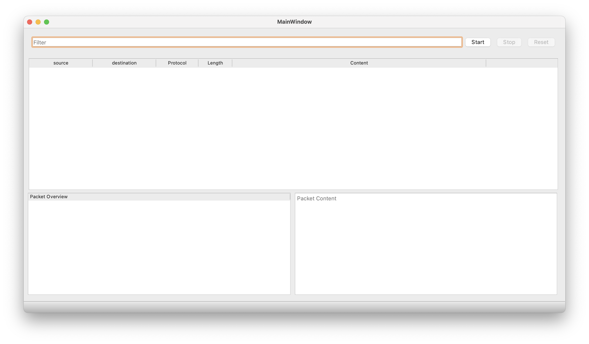
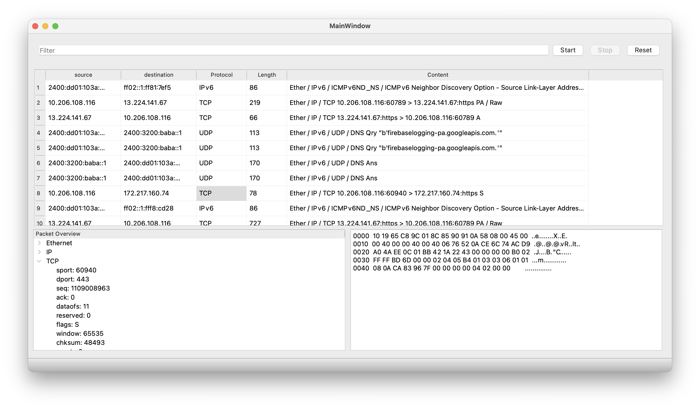
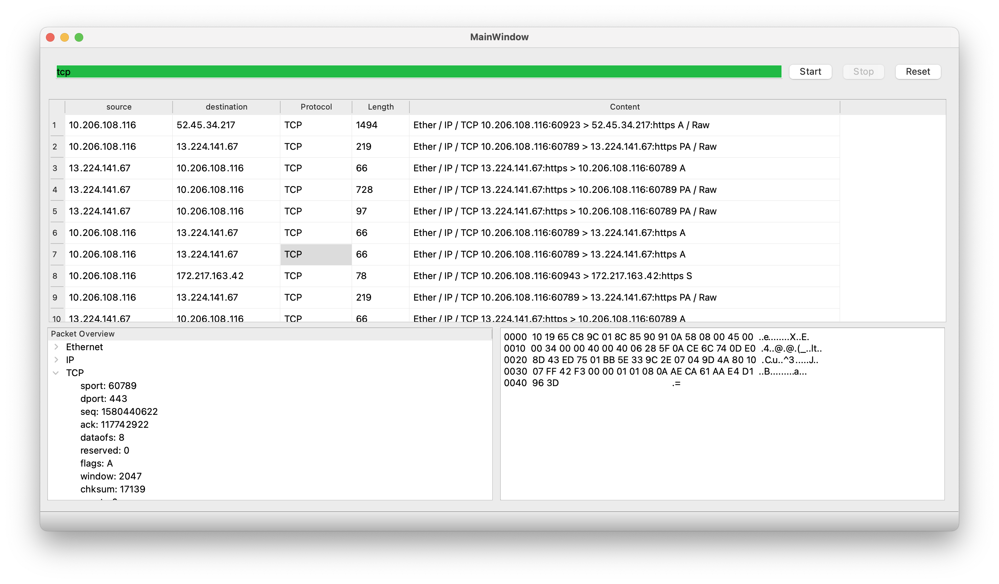

# 简易网络嗅探器的实现

[TOC]

## 实验目标

网络嗅探器是一种捕捉网络数据的工具，它可以捕捉所有流经本地网卡的数据包。此外，它还可以对捕捉到的数据包进行解析，即分析数据包的通信协议，解码并获得包中的原始信息。

Wireshark是全世界最常用的嗅探器工具之一。Wireshark可以显示数据包列表和数据包使用的协议中每一个字段的内容。本实验的目标是参考Wireshark，实现一个有基本功能的网络嗅探器，完成对网络数据包的捕捉和解析功能。除了基本功能外，本实验还要求实现GUI界面。


## 实验原理

在讨论嗅探器的具体实现之前，我们首先应当了解数据包在互联网上的传播方式。数据包在互联网上是根据IP地址进行寻址的。在数据包被转发到目标IP地址所在的子网后，子网内的路由器会将这个包进行广播，所以子网内的所有机器均可以收到这个包。除IP地址外，数据包中还包含了目标结点的MAC地址。一般来说，计算机中的网卡默认处在直接模式，此模式下，网卡会查看数据帧中的目的MAC地址，若与自己的不匹配，则丢弃。而网络嗅探器则会将网卡置于混杂模式，此时网卡会将所有的数据包都保存下来，从而达到嗅探的目的。


## 环境配置

本实验中，GUI和网络抓包逻辑均适用Python语言实现。本来考虑过用JAVA实现GUI设计，但因为我没有混合编程经验，担心上手比较慢，所以整个项目全部用Python实现了。

环境配置：macOS + Python 3.10 + PyQt5 + Scapy

### GUI

使用Python语言实现。主要借助PyQt库+Pycharm。可以完成GUI设计的Python库比较多，综合考虑下来，PyQt库使用最方便。PyQt不仅有强大的功能和内置函数，本身就拥有视化界面，可以通过鼠标操作来替代一些写代码的工作。

以下为安（踩）装（坑）教训：

#### Pycharm的安装

从官网下载即可。免费使用Community版（CE版）。

#### PyQt库的安装

```
$ pip install pyqt5
$ pip install pyqt5-tools
```

注意！由于Qt Designer已经在Python3.5版本从PyQt5转移到了tools，因此需要单独安装pyqt5-tools！这一点在很多较老的教程里都没有提到，会导致后面pyuic无法正常使用。

在命令行中尝试import pyqt5，若无报错，则说明安装成功。

```
smx1228@damifandeMacBook-Pro ~ % python
Python 3.9.7 (default, Sep 16 2021, 08:50:36) 
[Clang 10.0.0 ] :: Anaconda, Inc. on darwin
Type "help", "copyright", "credits" or "license" for more information.
>>> import PyQt5
>>> 
```

另一种检查的方法是在命令行中运行pip list，查看是否安装了上述两个库。

#### Qt Designer的安装

下载链接https://download.qt.io/archive/qt/

这个和上一条好像是重复的。但我本来以为是不一样的所以装了两遍？？

（不确定 再看看）

#### PyCharm中添加tools

打开PC的页面，在左上角PyCharm-Preferences-Tools-External Tools中添加新工具。

新工具1: Qt5Designer

本工具的作用是在PyCharm中打开Qt Designer，进行页面设计。

设置如下：



新工具2:PyUIC5

本工具的作用是，通过调用pyuic5工具，将生成的页面设计文件（.ui格式）转化为Python文件（.py格式）。

设置如下：



此时，可以打开项目文件，在顶部菜单栏中选择Tools- External Tools-Qt5Designer，即可打开qt的图形界面，设计后保存，即可获得该页面的.ui文档。选中该文档，在顶部菜单栏中选择Tools- External Tools-PyUIC5，即可在当前文件夹下生成对应的.py文件。

若想显示页面，在main.py中import mainpage，即可调用页面设计函数。运行main.py后即可显示主页面。

#### 函数接口

在设计页面时，我们用到的是Qt Designer的窗口/组件模式，但在使用内置的功能函数时，我们需要切换到信号/槽模式。和窗口模式类似，在此模式下，只需要用鼠标连线，即可实现组件之间的函数调用。

注意，假如发现某个调用关系错误，需要在Qt Designer页面上修改，不可以直接在pyuic生成的.py文件中修改，否则下次执行pyuic时，会将此次修改覆盖。

使用PyQt5生成的文件为mainpage.py，只要在main.py中import mainpage，即可给页面上的按钮设计自定义的处理函数。同上，调用mainpage组件接口的程序语句务必写在main.py文件中。

### 网络抓包和解析

使用Python语言实现。主要借助Scapy库。Scapy库的功能非常强大，它允许用户发送、嗅探、分析和伪造网络包。在本实验中，主要是用其中的嗅探和分析功能。

最初我尝试使用python libpcap库，因为这个库底层绑定了c语言的libpcap库，所以抓包效率非常高（[参考博客](https://blog.csdn.net/MacwinWin/article/details/110223128)）。但由于libpcap更适用于c语言，有关python实现的参考资料非常有限，且对数据包解析和过滤方面有所欠缺。综上考虑，最后改用了更流行的Scapy库。

Scapy库的使用指南非常多，因此不再一一列举各函数的用法。但在使用过程中曾遇到报错“找不到/dev/bpf*文件”。此问题可能是macOS系统独有，且较难复现，所以相关资料较少，花了很长时间才查到解决方法。此问题可能与访问权限有关。解决方法：

```
$ sudo chgrp admin /dev/bpf*
$ sudo chmod g+rw /dev/bpf*
```

此方法来源为[此篇博客](https://blog.csdn.net/qq_34319090/article/details/79810310)。

## 实现效果

主界面：



开始抓包：



设置过滤器：


