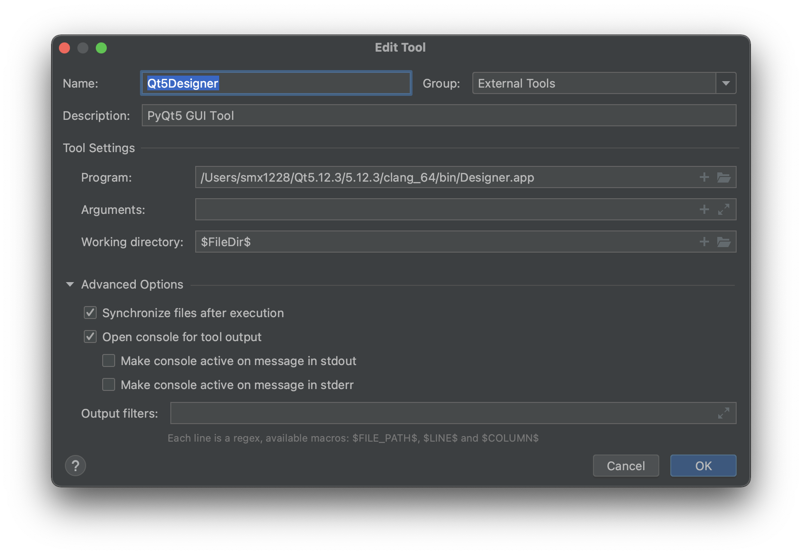
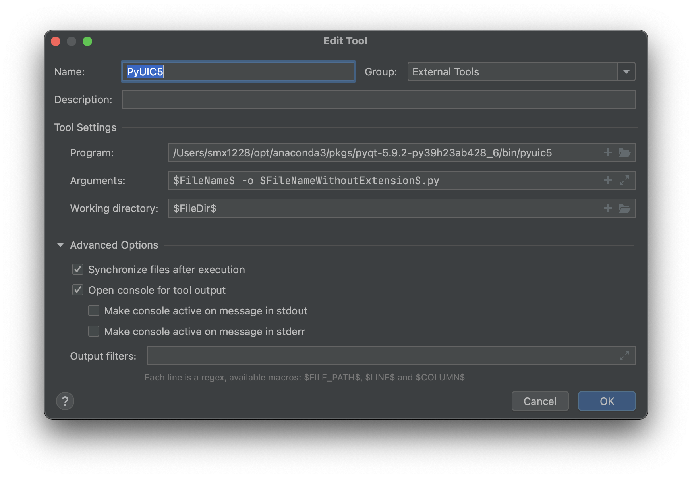

# 简易网络嗅探器的实现

[TOC]

## 实验目标

实现一个简易的网络嗅探器（类似Wireshark），拥有抓包和解析的功能，实现GUI页面

（待补充：嗅探器的意义和价值？展开说功能？）


## 环境配置

### GUI

使用Python语言实现。主要借助PyQt库+Pycharm（别人都是这么做的，应该是这俩比较好兼容）。Tkinter也是常用的python GUI库之一，但？？比较土，，不过现在实现的这个也挺土的。

以下为安（踩）装（坑）教训：

#### Pycharm的安装

从官网下载即可。免费使用Community版（CE版）。

#### PyQt库的安装

```
pip install pyqt5
pip install pyqt5-tools
```

注意！由于Qt Designer已经在Python3.5版本从PyQt5转移到了tools，因此需要单独安装pyqt5-tools！这一点在很多较老的教程里都没有提到，会导致后面pyuic无法正常使用。

在命令行中尝试import pyqt5，若无报错，则说明安装成功。

```
smx1228@damifandeMacBook-Pro ~ % python
Python 3.9.7 (default, Sep 16 2021, 08:50:36) 
[Clang 10.0.0 ] :: Anaconda, Inc. on darwin
Type "help", "copyright", "credits" or "license" for more information.
>>> import PyQt5
>>> 
```

另一种检查的方法是在命令行中运行pip list，查看是否安装了上述两个库。

#### Qt Designer的安装

下载链接https://download.qt.io/archive/qt/

这个和上一条好像是重复的。但我本来以为是不一样的所以装了两遍？？

（不确定 再看看）

#### PyCharm中添加tools

打开PC的页面，在左上角PyCharm-Preferences-Tools-External Tools中添加新工具。

新工具1: Qt5Designer

本工具的作用是在PyCharm中打开Qt Designer，进行页面设计。

设置如下：



新工具2:PyUIC5

本工具的作用是，通过调用pyuic5工具，将生成的页面设计文件（.ui格式）转化为Python文件（.py格式）。

设置如下：



此时，可以打开项目文件，在顶部菜单栏中选择Tools- External Tools-Qt5Designer，即可打开qt的图形界面，设计后保存，即可获得该页面的.ui文档。选中该文档，在顶部菜单栏中选择Tools- External Tools-PyUIC5，即可在当前文件夹下生成对应的.py文件。

若想显示页面，在main.py中import mainpage，即可调用页面设计函数。运行main.py后即可显示主页面。

### 网络抓包和解析

采用xxx库，安装。。。

## 开发过程

嗅探器的实现原理

